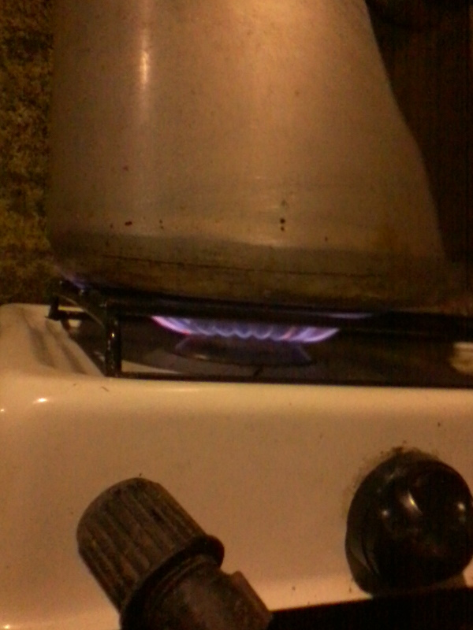

# Biogas
Biogas for small farm

Here are the first photos of the installation. Not much details to be seen here yet, but we are just starting to describe the installation.

We used pond foil to cover the tank and hold the gases as produced by the microbes. Since the cover must be air tight, we decided that it would be best to attache it to the tank well below liquid level.

From this photo you can see pieces of electricity (gauge 10) wire coming out of the wall some 40 cm from the top of the tank. These were used to attach the cover. You can also see where the inlet is going to be located.

Here you see a view from the outlet side of the tank. At the far end you can see the inlet mounted on top of the tank border.

Here you can see the beautiful blue flame of the gas. An installation like this produces about 50 percent methane (MH4) and 50 percent carbon dioxide (CO2), and some, but generally very little hydrogene sulfide (H2S). We have not yet done any filtering. We will add a filter to get rid of the H2S if it turns out to produce a noticeble smell (of rotten eggs).

Here is another photo of the stove with a pot over the flame.

Here you can clearly see the inlet. Also you can see here that a rather large part of the liquid is not covered. It would be nice if we could correct this.

And here you see how beautifully curved we made this tank. We thought it could take up less space like this, but it was probably a mistake.

