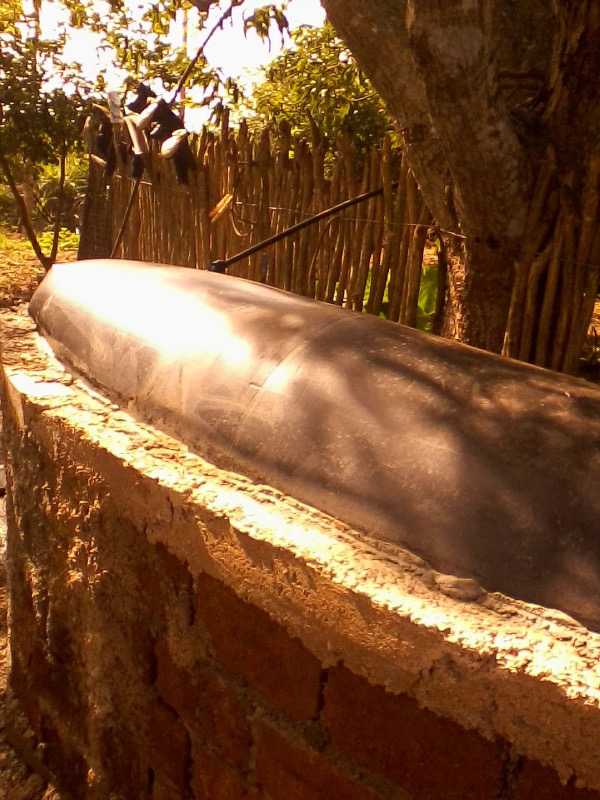
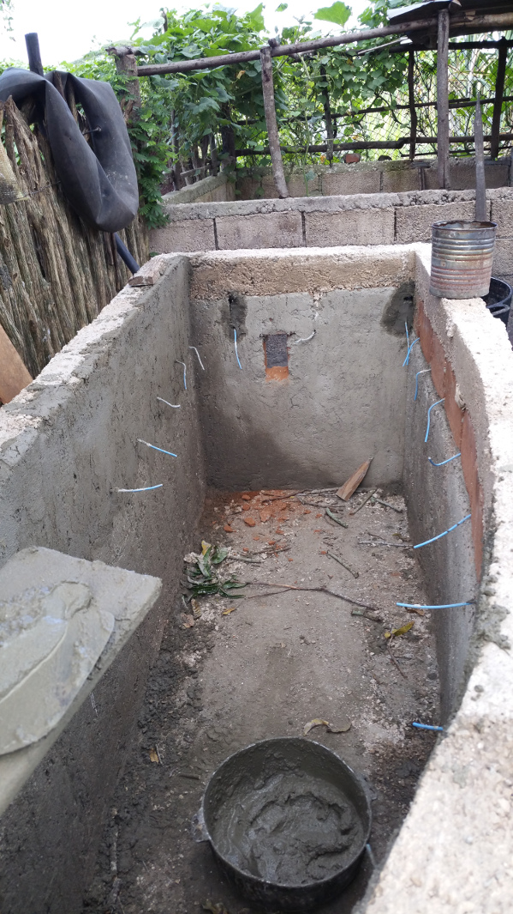

# Biogas
Biogas for small farm

Here are the first photos of the installation. Not much details to be seen here yet, but we are just starting to describe the installation.

We used pond foil to cover the tank and hold the gases as produced by the microbes. Since the cover must be air tight, we decided that it would be best to attache it to the tank well below liquid level.

From this photo you can see pieces of electricity (gauge 10) wire coming out of the wall some 40 cm from the top of the tank. These were used to attach the cover. You can also see where the inlet is going to be located.

