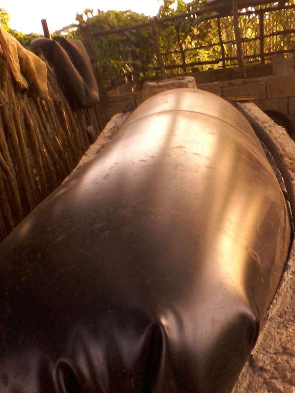

# Mesophilic Biodigester
## validated design

For more foto's (and some text) see [Fabrication.md](Fabrication.md).

## Purpose of this digester
Small biodigesters like the one on the foto, made in juli 2018, can be used in the context of family farms to improve life quality in an ecological way. Apart from considerable ecological impact by generating a truly closed loop of resources it also has economical benefits in several ways.
From the various types of installations that exist we chose the Plug-Flow type, the one on the foto cost about 125 dollar in Cuba. Waste generated by humans and/or animals can be processed by this device to produce biogas and fertilizers. This particular type of digester is espcially suitable for tropical and high temperature areas because it works best with a tank liquid temperature of 37 C (99 F).
## How it works
> A biodigester is like a mechanical stomach. It is fed with organic material, which is broken down (decomposed) by micro-organisms (bacteria) in an oxygen-free (anaerobic) environment to produce renewable energy in the form of biogas as well as an exceptionally good fertilizer.
> Anaerobic digestion is a collection of processes by which micro organisms break down biodegradable material in the absence of oxygen.[1] The process is used for industrial or domestic purposes to manage waste and to produce fuel.

## Use context
This biodegester can be used to process pig, cow and other kind of biomatter and probably agricutural waste like banana trees can be digester too.
The biodigester generates economic and ecologic value.
In the first place it produces biogas which can be used for cooking. For this reason these installations are often referred to as biogas plants.
Secondly it produces an excelent natural organic fertilizer that is used for the crops of the farm. This organic fertilizer has the following advantages:
1. It protects and enriches the soil structure in contrast with industrial fertilizers and pesticides.
2. The farmer does not need to buy potasium or other chemicaliën fertilizers.
3. The farmer does not need pesticides anymore or very little because the fertilizer makes the crops healthier and therefore more resistent against deseases and parasites.
4. The crop yield could be higher because the crops are healthier. We will do some testing to see the effect on banana trees.

## Design specifications
- The tank has a size of 300x100x100 cm exterior and 270x70x100 cm interior. The designed liquid hight is about 90 cm giving the installation a total of 1.8 m3 capacity.
- For the outlet any pipe or rigid tube with an inner diameter of 2cm or more can be used.
- The inlet pipe should have an inner diameter of at least 10cm.
- The gas outlet could be placed anywhere on the foil preferably using plastic components and a tube of at least 0.8 cm diameter.
- To attach the foil in a way that no gas can escape we chose to attach it to the tank wall some 40 cm from the top of the wall. Of course when no gas is used the liquid would be pressed down, eventually forcing the gas out of the tank to the air. The gas usage must keep up to the speed at which it is produced.

## References
1. [Retrieved "Remember the biodigester"](https://www.src.sk.ca/blog/remember-biodigester)
1. [Find more in wkikipedia](https://en.wikipedia.org/wiki/Anaerobic_digestion)
