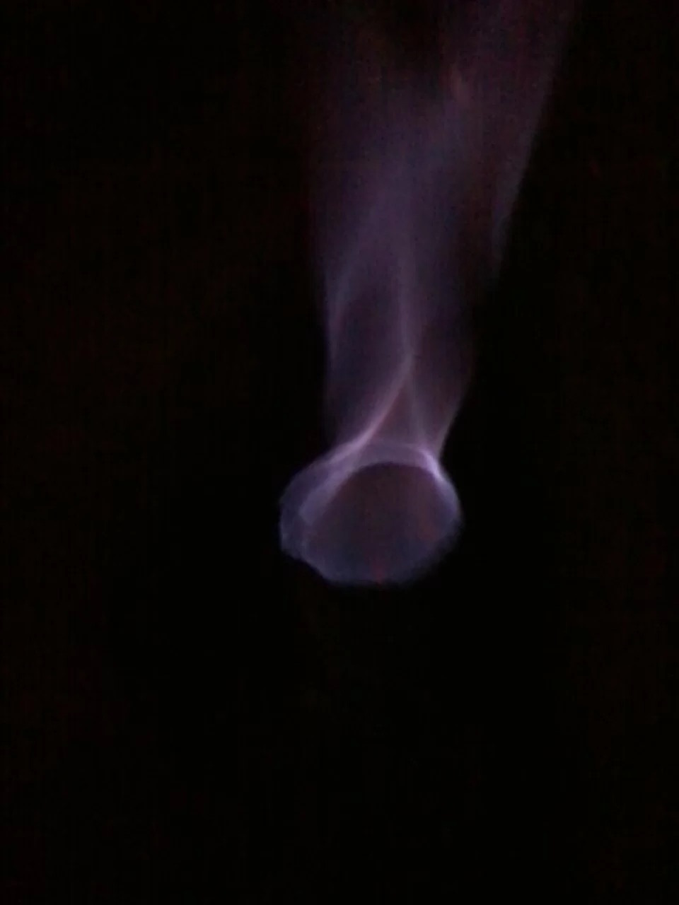

# Biogas
Biogas for small farm

Here is a first foto of the installation:

We used pond foil to cover the tank and hold the gases as produced by the microbes. Since the cover must be air tight, we decided that it would be best if it would be attached to the tank well below liquid level.

From this foto you can see pieces of electricity (gauge 10) wire coming out of the wall some 40 cm from the top of the tank. These were used to attach the cover.

